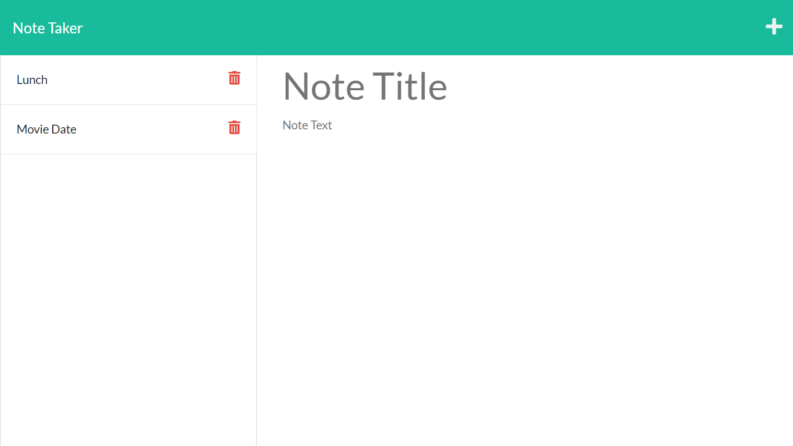

# note_taker
 

## Description
This project lets you create a Note-Taker, by using Express and saving data from a JSON file.

## Table of Contents
- [Installation](#installation)
- [Credits](#credits)
- [Deployment](#deployment)
- [License](#license)
- [Contact me](#contact-me)
## Installation

 You need to install Node.js and npm i express.

## Credits 
Zachary Auerbach

## Deployment

[Heroku](https://thawing-coast-19158.herokuapp.com/)

[GitHub Pages](https://github.com/GustavoTijerino1/note_taker)

## License

 MIT License

## Contact me
How to reach me if you have any additional questions.

[GitHub](https://github.com/GustavoTijerino1)

Email: busg26@gmail.com
